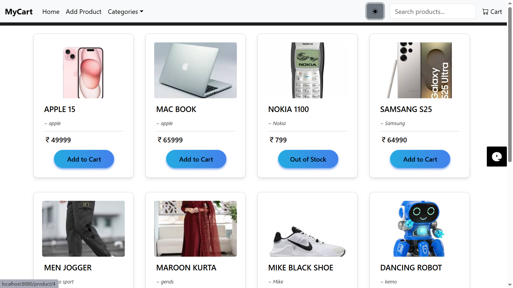
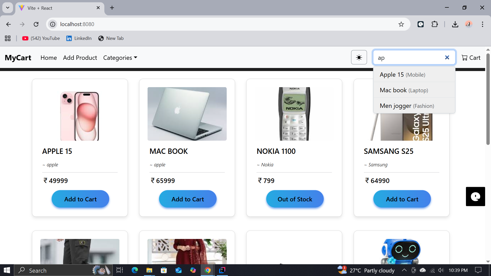
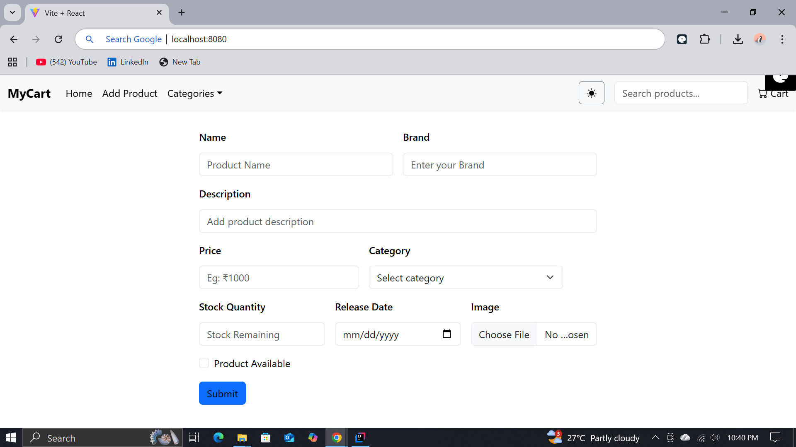
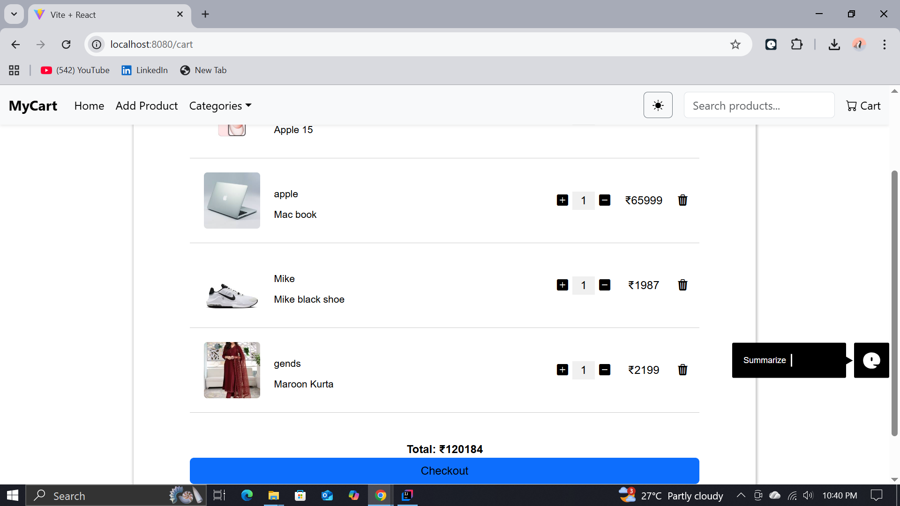
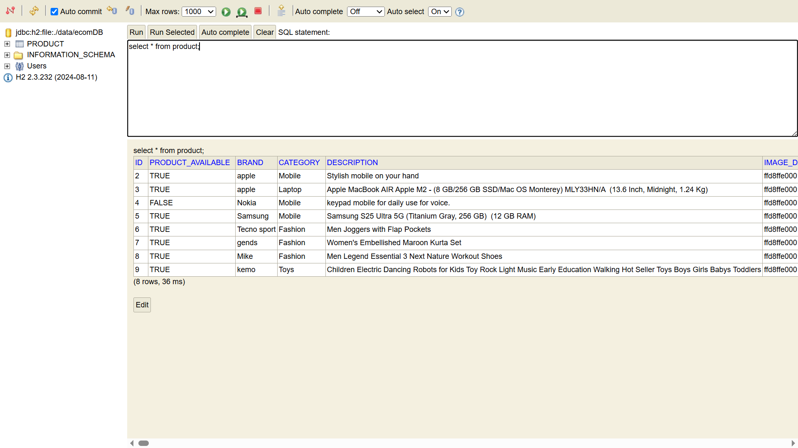

# 🛒 E-Commerce Web Application

A **full-stack e-commerce website** built with **Spring Boot (backend)** and **React (frontend)**.
This project demonstrates how to create, update, delete, and search products with image uploads, using RESTful APIs and a responsive React-based UI.

---

## 🚀 Tech Stack

### 🔹 Backend (Spring Boot)

* Spring Boot 3.x
* H2 Database (File-based storage)
* Spring Data JPA
* Maven
* RESTful APIs with JSON responses

### 🔹 Frontend (React)

* React.js
* Axios (for API integration)
* Bootstrap 5
* React Router

---

## ⚙️ Features

✅ Add new products with images
✅ Update and delete existing products
✅ View all products dynamically
✅ Search products by keyword or ID
✅ Category filter functionality
✅ Light/Dark mode toggle
✅ RESTful API design
✅ H2 database console for local debugging

---

## 📁 Project Structure

```
e-commerce/
│
├── backend/
│   ├── src/main/java/com/vishnu/ecom_proj/
│   │   ├── controller/
│   │   │   ├── ProductController.java
│   │   │   └── WebController.java
│   │   ├── model/
│   │   ├── service/
│   │   └── EcomProjApplication.java
│   ├── src/main/resources/
│   │   ├── application.properties
│   │   └── static/ (contains built React files)
│   └── target/
│       └── ecom-proj-0.0.1-SNAPSHOT.jar
│
└── frontend/
    ├── src/
    │   ├── components/
    │   ├── pages/
    │   └── App.js
    ├── public/
    └── package.json
```

---

## 🧠 API Endpoints (Postman Collection: `ecom-proj`)

| Method     | Endpoint                                 | Description                             |
| ---------- | ---------------------------------------- | --------------------------------------- |
| **GET**    | `/api/products`                          | Get all products                        |
| **GET**    | `/api/product/{id}`                      | Get product by ID                       |
| **POST**   | `/api/product`                           | Add new product (supports image upload) |
| **PUT**    | `/api/product/{id}`                      | Update product details                  |
| **DELETE** | `/api/product/{id}`                      | Delete product                          |
| **GET**    | `/api/products/search?keyword={keyword}` | Search product by keyword               |

> 🧩 Import `ecom-proj.postman_collection.json` into **Postman** to test APIs easily.

---

## 🛠️ Configuration

**File:** `application.properties`

```properties
spring.application.name=ecom-proj
spring.datasource.url=jdbc:h2:file:./data/ecomDB
spring.datasource.username=mycart
spring.datasource.password=123456
spring.jpa.show-sql=true
spring.h2.console.enabled=true
spring.jpa.hibernate.ddl-auto=update
```

To access the H2 console:
🔗 [http://localhost:8080/h2-console](http://localhost:8080/h2-console)
**JDBC URL:** `jdbc:h2:file:./data/ecomDB`
**Username:** `mycart`
**Password:** `123456`

---

## 🧰 How to Run

### 🖥 Backend (Spring Boot)

```bash
cd backend
mvn clean package
java -jar target/ecom-proj-0.0.1-SNAPSHOT.jar
```

Backend will start at 👉 `http://localhost:8080/`

### 🌐 Frontend (React)

```bash
cd frontend
npm install
npm start
```

Frontend runs at 👉 `http://localhost:3000/`

> ⚡ When you build for production:
> Run `npm run build` and copy the contents of the `build/` folder into your backend’s `src/main/resources/static/` directory, then rebuild your `.jar`.

---

## 🌍 Unified Deployment (Single JAR)

After building the frontend:

```bash
npm run build
```

Copy the `build` folder contents to:

```
backend/src/main/resources/static/
```

Then rebuild:

```bash
cd backend
mvn clean package
java -jar target/ecom-proj-0.0.1-SNAPSHOT.jar
```

Now the complete app (frontend + backend) runs on:
👉 `http://localhost:8080/`

---

## 📦 Postman Collection

The **Postman API collection file** (`ecom-proj.postman_collection.json`) is included in this repository.
You can import it into Postman to test all endpoints directly.

---

## 📸 Screenshots

### 🏠 Homepage and Product List


### 🛍️ search


### ➕ Add Product Page


### Cart Page


### H2-  data base


---

## 💡 Author

👤 **Vishnu Bachala**
📧 *http://linkedin.com/in/vishnu-bachala*
🧠 *Java | SQL | Spring Boot | React | github*

---


